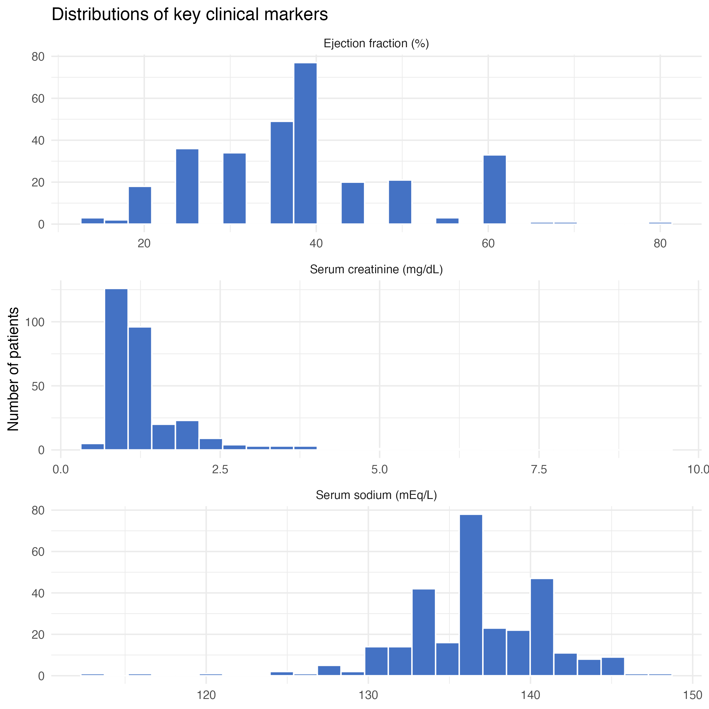
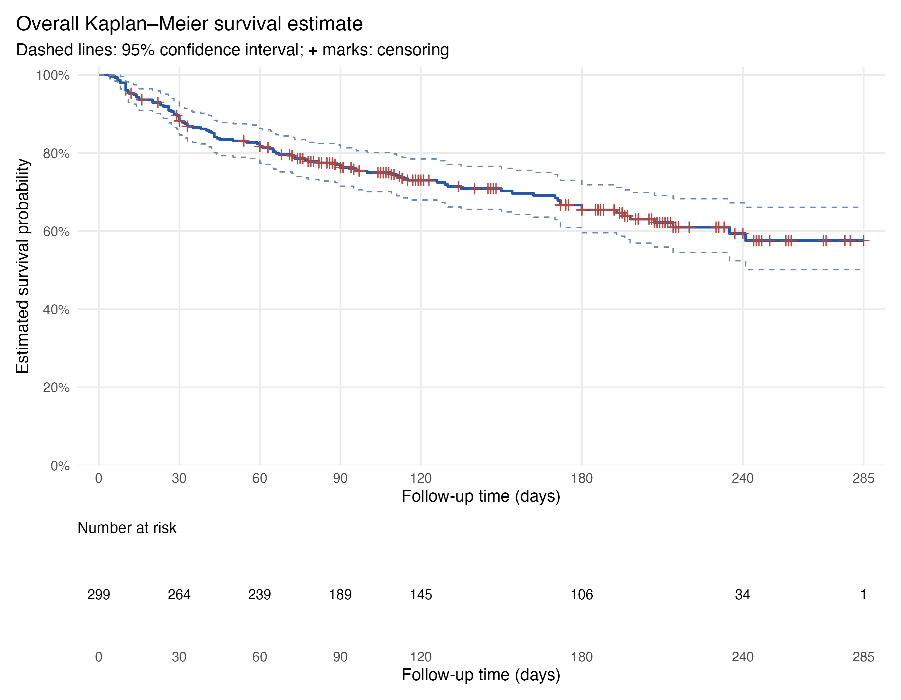
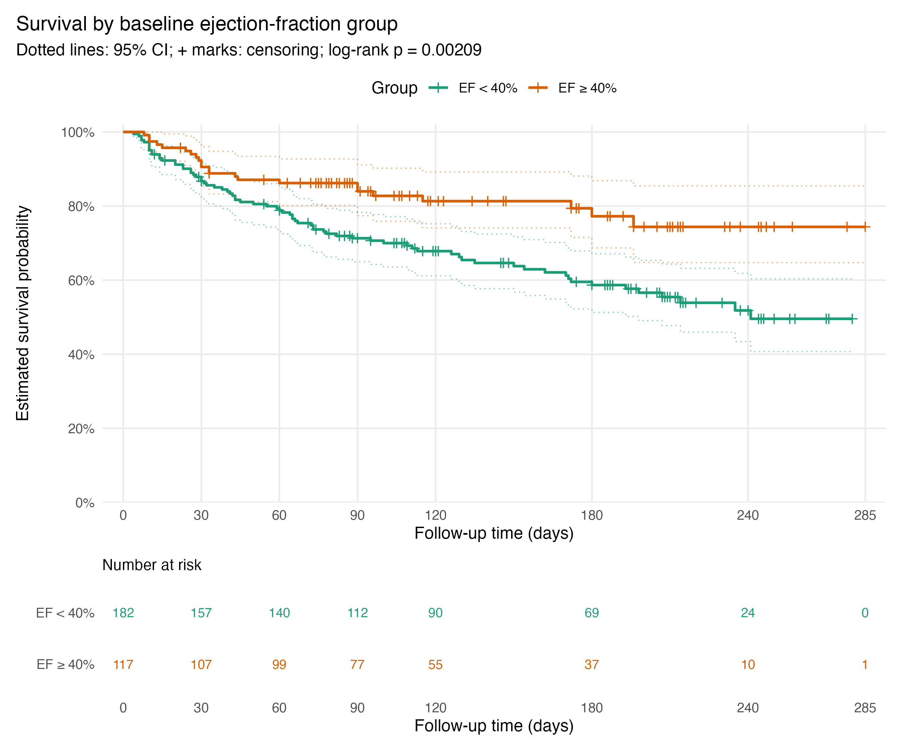
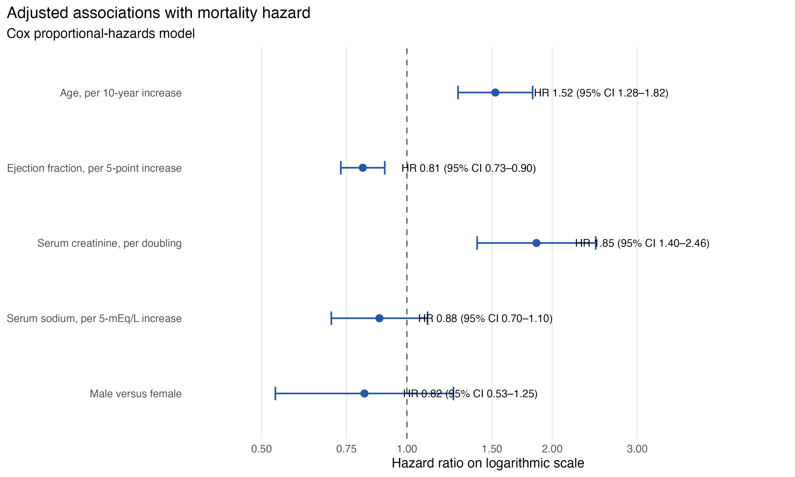
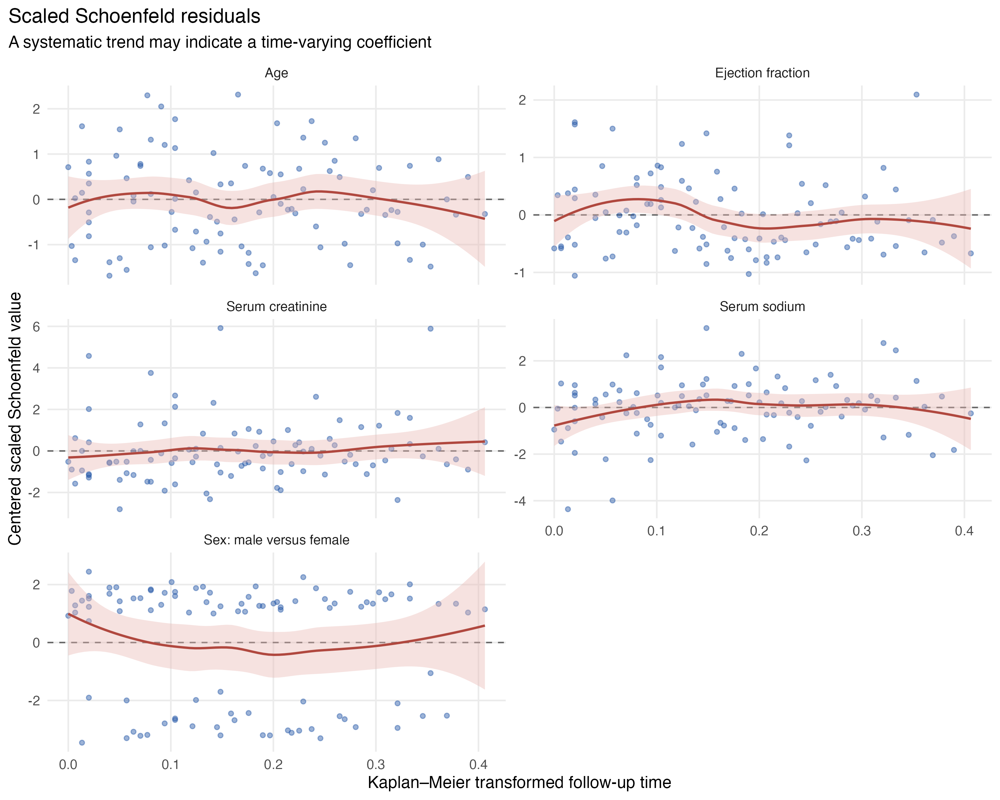
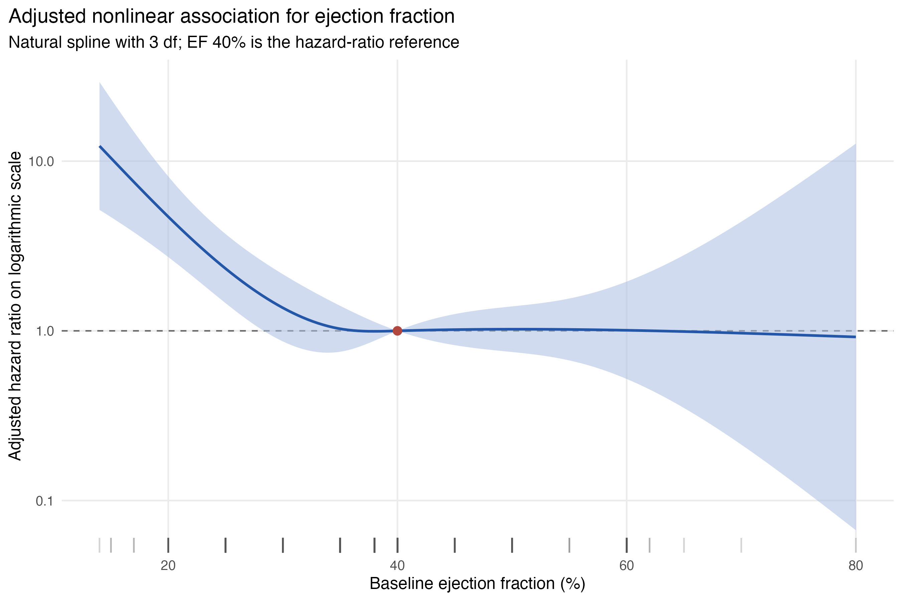
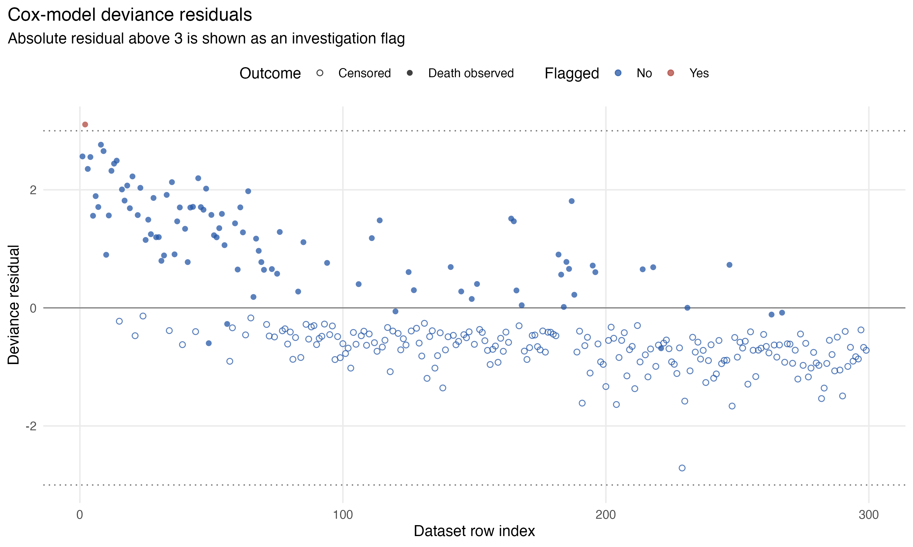
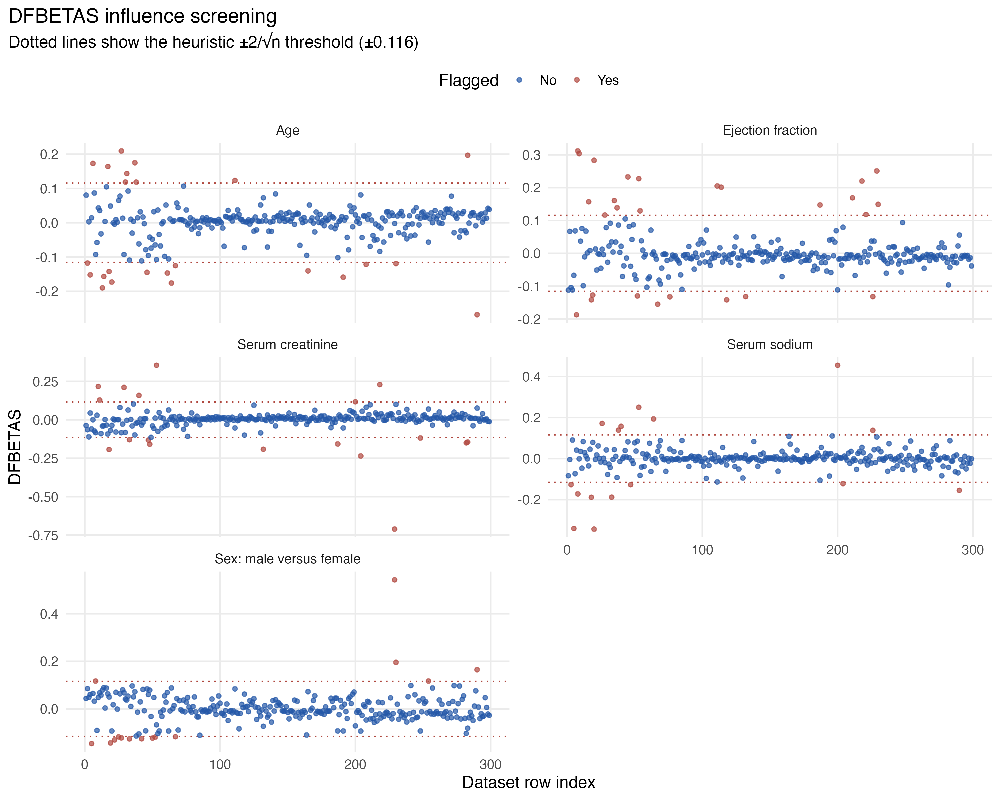
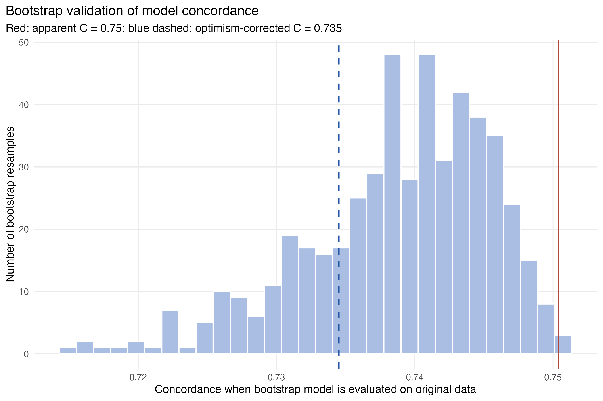
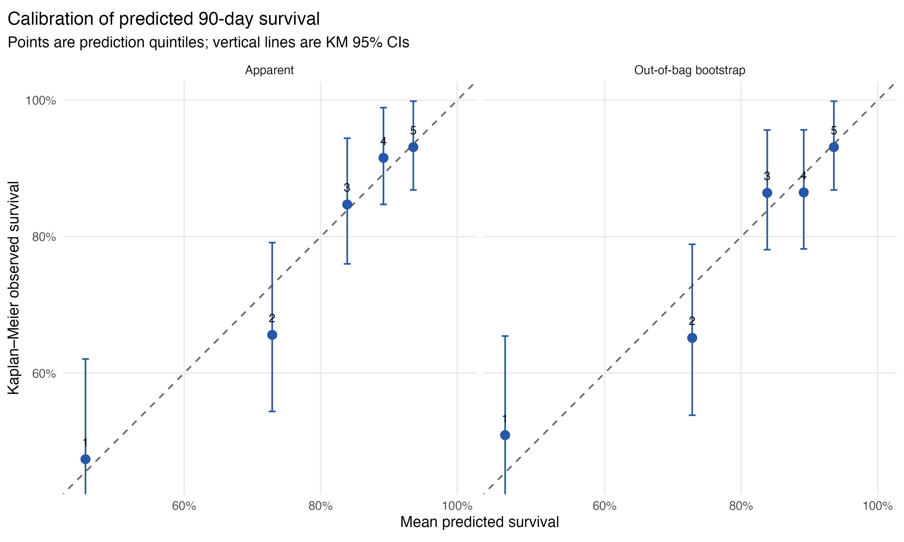

Survival Analysis in R: A Worked Beginner Tutorial
================
cjgunase
July 28, 2026

- [Purpose of this tutorial](#purpose-of-this-tutorial)
  - [Learning goals](#learning-goals)
- [1. The data](#1-the-data)
- [2. Censoring](#2-censoring)
- [3. Kaplan–Meier survival](#3-kaplanmeier-survival)
  - [Calculation with the first
    events](#calculation-with-the-first-events)
- [4. Comparing groups](#4-comparing-groups)
- [5. Cox proportional-hazards
  regression](#5-cox-proportional-hazards-regression)
- [6. Model diagnostics](#6-model-diagnostics)
  - [Proportional hazards](#proportional-hazards)
  - [Nonlinear relationships](#nonlinear-relationships)
  - [Unusual and influential
    observations](#unusual-and-influential-observations)
- [7. Bootstrap internal validation](#7-bootstrap-internal-validation)
  - [Calibration](#calibration)
- [8. Conclusions](#8-conclusions)
- [9. Reproduce the project](#9-reproduce-the-project)
- [10. Limitations](#10-limitations)

# Purpose of this tutorial

Survival analysis studies **whether an event occurs and how long it
takes**. It is especially useful when participants have different
follow-up times or when their eventual event times are unknown.

This tutorial answers:

> Which baseline patient characteristics are associated with time to
> death among patients with heart failure?

The analysis is educational and prognostic. It does not estimate causal
effects and must not be used for clinical decisions.

## Learning goals

By the end, a reader should be able to:

1.  distinguish an observed event from censoring;
2.  explain a risk set and survival function;
3.  calculate and interpret Kaplan–Meier survival;
4.  compare curves with a log-rank test;
5.  interpret adjusted Cox hazard ratios;
6.  recognize proportional-hazards and functional-form assumptions;
7.  distinguish apparent from internally validated performance.

# 1. The data

The [UCI Heart Failure Clinical Records
dataset](https://archive.ics.uci.edu/dataset/519/heart) contains records
for 299 patients. Its license is CC BY 4.0.

``` r
heart |>
  select(
    followup_days,
    death,
    age,
    ejection_fraction,
    serum_creatinine,
    serum_sodium,
    sex_group
  ) |>
  head() |>
  knitr::kable(
    caption = "Example analysis records"
  )
```

| followup_days | death | age | ejection_fraction | serum_creatinine | serum_sodium | sex_group |
|---:|---:|---:|---:|---:|---:|:---|
| 4 | 1 | 75 | 20 | 1.9 | 130 | Male |
| 6 | 1 | 55 | 38 | 1.1 | 136 | Male |
| 7 | 1 | 65 | 20 | 1.3 | 129 | Male |
| 7 | 1 | 50 | 20 | 1.9 | 137 | Male |
| 8 | 1 | 65 | 20 | 2.7 | 116 | Female |
| 8 | 1 | 90 | 40 | 2.1 | 132 | Male |

Example analysis records

The survival outcome has two columns:

- `followup_days`: observed time under follow-up;
- `death`: 1 if death was observed and 0 if the patient was censored.

| metric                 | value |
|:-----------------------|:------|
| Rows                   | 299.0 |
| Analysis columns       | 13.0  |
| Duplicate rows         | 0.0   |
| Missing cells          | 0.0   |
| Observed deaths        | 96.0  |
| Censored observations  | 203.0 |
| Death proportion       | 32.1% |
| Minimum follow-up days | 4.0   |
| Median follow-up days  | 115.0 |
| Maximum follow-up days | 285.0 |

Data-quality and outcome summary

<div class="figure" style="text-align: center">


<p class="caption">

Distributions of prespecified clinical predictors.
</p>

</div>

Serum creatinine and creatinine phosphokinase are strongly right-skewed.
Extreme values should be checked for plausibility, not automatically
deleted.

# 2. Censoring

A patient censored after 100 days tells us:

$$T>100$$

The patient was known to remain event-free for at least 100 days, but
their eventual death time is unknown.

Censored patients:

- contribute to risk sets while observed;
- leave the risk set at censoring;
- are not counted as deaths;
- are not assumed to survive forever.

``` r
survival_outcome <- with(
  heart,
  Surv(followup_days, death)
)

head(survival_outcome)
```

    ## [1] 4 6 7 7 8 8

`Surv()` represents time and event status together. A printed `+`
identifies a censored observation.

> The central assumption is independent censoring: after accounting for
> relevant information, censoring should not be systematically related
> to unobserved future event risk.

# 3. Kaplan–Meier survival

The survival function is:

$$S(t)=P(T>t)$$

At event time $t_j$:

- $n_j$ is the number at risk immediately before the time;
- $d_j$ is the number of deaths at the time.

The conditional probability of surviving that event time is:

$$p_j=\frac{n_j-d_j}{n_j}$$

Kaplan–Meier multiplies these conditional probabilities:

$$\hat S(t)=
\prod_{t_j\leq t}
\left(1-\frac{d_j}{n_j}\right)$$

## Calculation with the first events

At day 4, one of 299 patients died:

$$\hat S(4)=\frac{298}{299}=0.9967$$

At day 6, one of the remaining 298 died:

$$\hat S(6)=
\frac{298}{299}\times\frac{297}{298}
=0.9933$$

At day 7, two of 297 at-risk patients died:

$$\hat S(7)=
0.9933\times\frac{295}{297}
=0.9866$$

``` r
overall_km <- survfit(
  Surv(followup_days, death) ~ 1,
  data = heart,
  conf.type = "log"
)
```

<div class="figure" style="text-align: center">


<p class="caption">

Overall Kaplan–Meier estimate with confidence interval, censor marks,
and numbers at risk.
</p>

</div>

| Time, days | Number at risk | Survival | 95% CI      |
|-----------:|---------------:|:---------|:------------|
|         30 |            264 | 88.2%    | 84.6%–92.0% |
|         60 |            239 | 81.7%    | 77.4%–86.3% |
|         90 |            189 | 76.3%    | 71.5%–81.3% |
|        180 |            106 | 65.4%    | 59.6%–71.9% |
|        270 |              6 | 57.6%    | 50.1%–66.1% |

Overall survival estimates

At 90 days, estimated survival was 76.3% (95% CI: 71.5%–81.3%).

The curve never reached 50%, so median survival was **not reached**.
This does not mean median survival is infinite; it means the available
follow-up cannot estimate it.

# 4. Comparing groups

Grouped Kaplan–Meier curves describe unadjusted survival patterns.

``` r
ef_km <- survfit(
  Surv(followup_days, death) ~ ef_group,
  data = heart
)

ef_log_rank <- survdiff(
  Surv(followup_days, death) ~ ef_group,
  data = heart
)
```

<div class="figure" style="text-align: center">


<p class="caption">

Kaplan–Meier estimates by educational ejection-fraction group.
</p>

</div>

| Group     | Time, days | Number at risk | Survival | 95% CI      |
|:----------|-----------:|---------------:|:---------|:------------|
| EF \< 40% |         30 |            157 | 86.7%    | 81.9%–91.8% |
| EF \< 40% |         90 |            112 | 71.3%    | 64.9%–78.3% |
| EF \< 40% |        180 |             69 | 58.7%    | 51.3%–67.1% |
| EF ≥ 40%  |         30 |            107 | 90.6%    | 85.4%–96.0% |
| EF ≥ 40%  |         90 |             77 | 84.0%    | 77.4%–91.1% |
| EF ≥ 40%  |        180 |             37 | 77.2%    | 68.7%–86.8% |

Survival estimates by ejection-fraction group

The log-rank test compares observed with expected deaths over follow-up:

| Comparison              | Chi-square |  df | p-value |
|:------------------------|-----------:|----:|:--------|
| Ejection fraction group |      9.470 |   1 | 0.00209 |
| Sex                     |      0.004 |   1 | 0.94975 |

Log-rank tests

There was evidence of different survival curves between
ejection-fraction groups ($\chi^2=9.47$, $p=0.0021$). There was no
evidence of a sex difference ($p=0.950$).

These are unadjusted associations. A p-value does not measure effect
size and does not establish causation.

# 5. Cox proportional-hazards regression

The Cox model is:

$$h(t\mid X)
=
h_0(t)\exp(\beta_1X_1+\cdots+\beta_pX_p)$$

At every death time, the partial likelihood compares the patient who
died with patients still in the risk set. The model estimates relative
hazard without requiring a parametric shape for $h_0(t)$.

``` r
adjusted_model <- coxph(
  Surv(followup_days, death) ~
    age_per_10_years +
    ef_per_5_points +
    creatinine_per_doubling +
    sodium_per_5_units +
    sex_group,
  data = heart,
  ties = "efron"
)
```

| Predictor                               | HR   | 95% CI    | p-value |
|:----------------------------------------|:-----|:----------|:--------|
| Age, per 10-year increase               | 1.52 | 1.28–1.82 | \<0.001 |
| Ejection fraction, per 5-point increase | 0.81 | 0.73–0.90 | \<0.001 |
| Serum creatinine, per doubling          | 1.85 | 1.40–2.46 | \<0.001 |
| Serum sodium, per 5-mEq/L increase      | 0.88 | 0.70–1.10 | 0.263   |
| Male versus female                      | 0.82 | 0.53–1.25 | 0.350   |

Adjusted Cox proportional-hazards results

<div class="figure" style="text-align: center">


<p class="caption">

Adjusted hazard ratios from the initial linear Cox model.
</p>

</div>

Interpretation examples:

- A 10-year age increase was associated with 52% higher mortality
  hazard.
- A 5-point ejection-fraction increase was associated with 19% lower
  hazard.
- A creatinine doubling was associated with 85% higher hazard.

Each interpretation is conditional on the other included predictors.
Hazard ratios are relative rates, not direct differences in survival
probability.

# 6. Model diagnostics

## Proportional hazards

The Cox model assumes each hazard ratio is approximately constant over
follow-up.

``` r
ph_assessment <- cox.zph(adjusted_model)
ph_assessment
```

    ##                         chisq df    p
    ## age_per_10_years        0.452  1 0.50
    ## ef_per_5_points         3.526  1 0.06
    ## creatinine_per_doubling 1.047  1 0.31
    ## sodium_per_5_units      0.231  1 0.63
    ## sex_group               0.217  1 0.64
    ## GLOBAL                  6.843  5 0.23

The global test gave $p=0.233$, providing no clear evidence of a
violation. Ejection fraction had the strongest possible trend
($p=0.060$), so graphical assessment remained important.

<div class="figure" style="text-align: center">


<p class="caption">

Centered scaled Schoenfeld diagnostics.
</p>

</div>

## Nonlinear relationships

The initial Cox model assumes a straight-line relationship between each
continuous predictor and log hazard. Natural splines test whether that
shape is too restrictive.

| Predictor         | Added df | LR chi-square | p-value | Linear AIC | Spline AIC |
|:------------------|---------:|--------------:|:--------|-----------:|-----------:|
| Age               |        2 |          5.40 | 0.06725 |      957.6 |      956.2 |
| Ejection fraction |        2 |         13.36 | 0.00126 |      957.6 |      948.2 |
| Serum creatinine  |        2 |          0.30 | 0.86087 |      957.6 |      961.3 |
| Serum sodium      |        2 |          0.41 | 0.81542 |      957.6 |      961.2 |

Predictor-specific functional-form tests

Ejection fraction showed strong evidence of nonlinearity ($p=0.0013$).
The estimated hazard increased sharply at very low values and was
comparatively flat around and above 40%.

<div class="figure" style="text-align: center">


<p class="caption">

Adjusted nonlinear ejection-fraction association, referenced to EF 40%.
</p>

</div>

Confidence intervals widen at sparse extremes. The rug marks show where
patients were observed.

## Unusual and influential observations

One patient had an absolute deviance residual greater than 3. DFBETAS
also identified observations that affected individual coefficients.

<div class="figure" style="text-align: center">


<p class="caption">

Deviance-residual and DFBETAS screening.
</p>

</div>

<div class="figure" style="text-align: center">


<p class="caption">

Deviance-residual and DFBETAS screening.
</p>

</div>

These observations are not automatically errors. They may represent
scientifically informative combinations of predictors and outcomes.

# 7. Bootstrap internal validation

The refined model used a 3-df ejection-fraction spline. It was fixed
before validation.

For each of 500 bootstrap resamples:

1.  sample patients with replacement;
2.  refit the complete model;
3.  calculate concordance in the bootstrap sample;
4.  apply the model to the original sample;
5.  estimate optimism as training minus test performance;
6.  generate predictions for out-of-bag patients.

| statistic                      | value |
|:-------------------------------|:------|
| Requested bootstrap resamples  | 500   |
| Successful bootstrap fits      | 500   |
| Apparent concordance           | 0.750 |
| Mean estimated optimism        | 0.016 |
| Optimism-corrected concordance | 0.735 |

Bootstrap internal-validation summary

<div class="figure" style="text-align: center">


<p class="caption">

Bootstrap validation of concordance.
</p>

</div>

Apparent concordance was 0.750. After subtracting estimated optimism of
0.016, corrected concordance was 0.735.

## Calibration

Discrimination asks whether the model ranks patients correctly.
Calibration asks whether predicted probabilities agree with observed
survival.

<div class="figure" style="text-align: center">


<p class="caption">

Apparent and out-of-bag calibration of 90-day survival.
</p>

</div>

Out-of-bag calibration was broadly reasonable, although the second
prediction quintile overpredicted survival by approximately eight
percentage points. Groups contained only about 60 patients, producing
wide confidence intervals.

# 8. Conclusions

Within this dataset:

1.  survival declined progressively over observed follow-up;
2.  very low ejection fraction was associated with poorer survival;
3.  older age and higher serum creatinine were associated with higher
    adjusted mortality hazard;
4.  the ejection-fraction association was nonlinear;
5.  the refined model had optimism-corrected concordance around 0.735;
6.  calibration was imperfect in part of the risk range.

These findings describe associations in a small observational dataset.
They do not show causal effects or establish performance in other
populations.

# 9. Reproduce the project

Run the scripts from the repository root:

``` bash
Rscript R/01-download-data.R
Rscript R/02-exploratory-analysis.R
Rscript R/03-kaplan-meier.R
Rscript R/04-group-comparisons.R
Rscript R/05-cox-regression.R
Rscript R/06-model-diagnostics.R
Rscript R/07-bootstrap-validation.R
```

Then render this report:

``` r
rmarkdown::render(
  "report/survival-analysis-tutorial.Rmd",
  output_format = "all"
)
```

The detailed living study guide is available in `notes.md`.

# 10. Limitations

- The sample contains only 299 patients and 96 observed deaths.
- Predictor selection and transformations depend partly on this dataset.
- Group cutpoints lose continuous information.
- Internal bootstrap validation does not replace external validation.
- Measurement error and unmeasured predictors may affect results.
- Independent censoring cannot be fully verified from the observed data.
- The analysis cannot support causal or clinical treatment claims.
